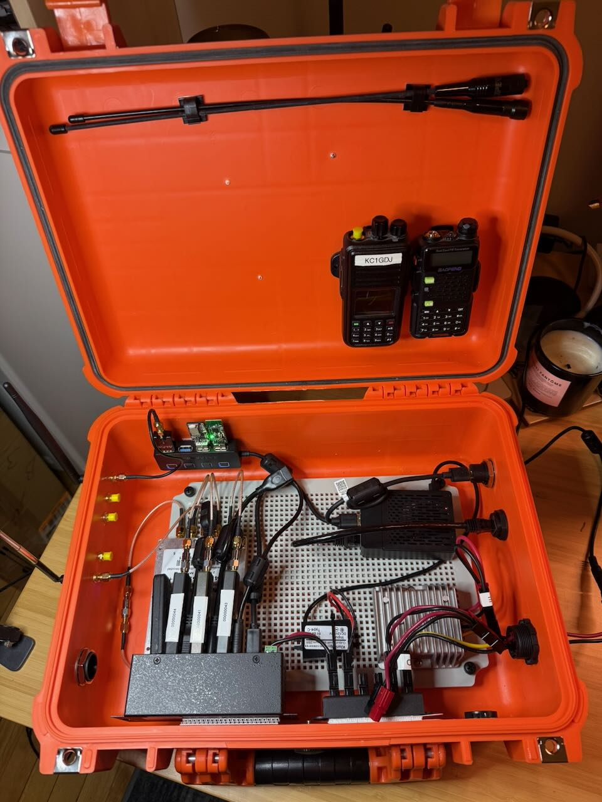
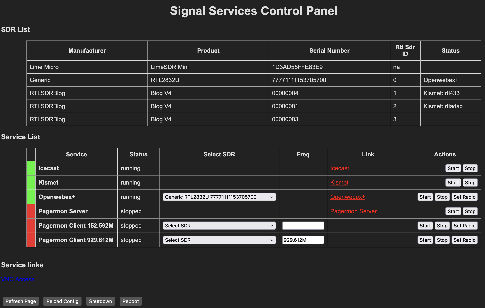

# signals_box

This is a portable multisignal detection system. This setup is inspired by [this](https://hackaday.com/wp-content/uploads/2025/10/jawn02_busybox.jpg) built by [busysignal](https://github.com/busysignal/) which I found on a image from Jawncon 0x2 on on Hackaday. This carying case is designed to connect multiple RF sensors including RTL-SDRs and other signal specific sensors. Many of the components I already had when I started this project in an attmept to keep costs down.

On top of this I am building a web app that will allow me to control the system from a web browser, allowinf start and stop of various applications to collect specific signals.

This is a work in progress.

## Current Parts

Radios
- [PWR DIV / SMA / RoHS \| ZN4PD1-63W-S+ \| Mini-Circuits](https://www.minicircuits.com/WebStore/dashboard.html?model=ZN4PD1-63W-S%2B)
- 4x RTL-SDR 
    - 3x RTL-SDR v4
    - 1x Old RTL-SDR
- Airspy R2
- CC2531 - Zigbee and IEEE 802.15.4 wireless MCU with up to 256kB Flash and 8kB RAM
- CC3540 - Bluetooth Low Energy (BLE) Wireless Module
- ALFA Network AWUS036ACS Wide-Coverage Dual-Band AC600 USB Wireless Wi-Fi Adapter
- USB GPS Module Beidou Glonass Receiver Navigation GPS Antenna IPX to SMA Cable

USB
- SABRENT 4-Port USB 3.0 Hub with Individual LED Power Switches - Slim, Portable Design - 2 Ft Cable - Fast Data Transfer - Compatible with Mac & PC (HB-UM43) 
- [7-Port USB 3.0 Hub (5Gbps) - Metal Industrial USB-A Hub with ESD Protection & 350W Surge Protection](https://www.startech.com/en-us/usb-hubs/st7300usbme)

Compute
- [Radxa X4](https://radxa.com/products/x/x4/)
- waveshare 7inch HDMI LCD IPS Capacitive Touch Screen 1024×600 Display Monitor

Case
- LeMotech Mounting Plate for Junction Box
- [2800 Weatherproof Protective Case, Medium, Orange](https://www.harborfreight.com/2800-weatherproof-protective-case-medium-orange-58655.html)
- 2 Port Power Pole Panel mount
- USB3 and Ethernet Panel Mount

Power
- Chunzehui F-1011 6-Position 45A Power Pole Distribution Block Module, Connector Power Splitter Distributor Source Strip
- Klnuoxj DC 12V/24V to 5V USB C Step Down Converter Type-C Interface 5A 25W
- Cllena DC 8V-40V to 12V 10A Automatic Buck Boost Converter

## Signal_ctl - Device and service Manager

This tool can use used to start and stop services, manage USB devices, and control other applications. It is designed to be a simple tool for managing your Multi SDR setup. Supported service types:
- systemd
- docker
- cli (command line) (work in progress)

It will list SDR devices and the Rtl-Sdr device numbers if relavent. 

## Tested Tools
- https://trunkrecorder.com/
- https://github.com/chuot/rdio-scanner/tree/master
- https://github.com/smittix/intercept
- https://fms.komkon.org/OWRX/
- https://github.com/pagermon
- https://www.kismetwireless.net

## TODO

### Control Software
- [ ] API Implenentation
- [ ] Make CLI Service Management work
    - Script args
    - Service State Management

### System
- [ ] Ansible Build Script