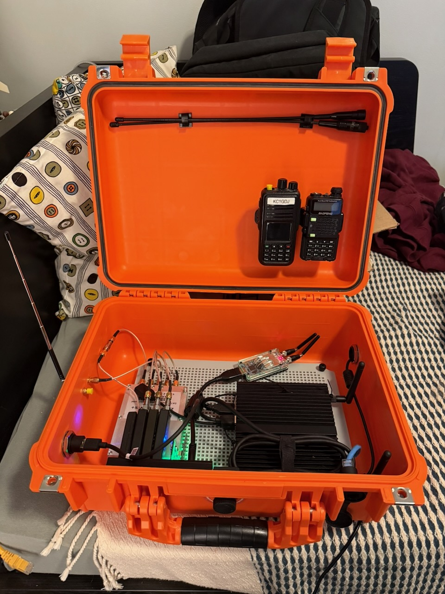

# signals_box

This is a portable multisignal detection system. This setup is inspired by [this](https://hackaday.com/wp-content/uploads/2025/10/jawn02_busybox.jpg) built by [busysignal](https://github.com/busysignal/) which I found on a image from Jawncon 0x2 on on Hackaday. This carying case is designed to connect multiple RF sensors including RTL-SDRs and other signal specific sensors. Many of the components I already had when I started this project in an attmept to keep costs down.

On top of this I am building a web app that will allow me to control the system from a web browser, allowinf start and stop of various applications to collect specific signals.

This is a work in progress.

## Current Parts
- [PWR DIV / SMA / RoHS \| ZN4PD1-63W-S+ \| Mini-Circuits](https://www.minicircuits.com/WebStore/dashboard.html?model=ZN4PD1-63W-S%2B)
- 4x RTL-SDR 
    - 3x RTL-SDR v4
    - 1x Old RTL-SDR
- 1x LimeSDR Mini v1
- CC2531 - Zigbee and IEEE 802.15.4 wireless MCU with up to 256kB Flash and 8kB RAM
- [Bluefruit LE Sniffer - Bluetooth®Low Energy 4.0 - nRF5182 \[Firmware Version 2\] : ID 2269 : Adafruit Industries, Unique & fun DIY electronics and kits](https://www.adafruit.com/product/2269)
- USBGear 7-Port USB 3.2 Gen 1 
- LeMotech Mounting Plate for Junction Box
- [2800 Weatherproof Protective Case, Medium, Orange](https://www.harborfreight.com/2800-weatherproof-protective-case-medium-orange-58655.html)
- [Qotom X86 Mini PC Q190G4N](https://www.aliexpress.com/i/3256804930512617.html)

## TODO
### Hardware
- [] Power System

### Control Software
- [] Service Manager
- [] API Implenentation

### System
- [] Network Bridge Setup
- [] Ansible Build Script